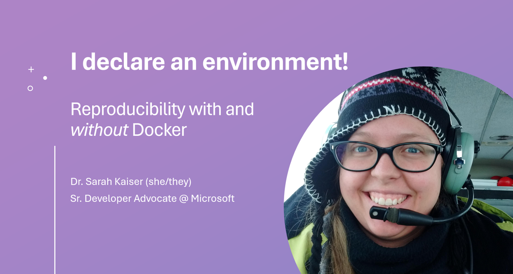

# 
[Schedule](https://pretalx.com/pycascades-2024/talk/JQPXA9/) | [Slides](slides.pdf)

A software project being called "reproducible" can mean a lot of things, but usually includes a description of how and where the code in your project can be run. Often this means including Python virtual environment, a Conda environment, or even a Docker container to help others replicate your work. In this talk I will introduce some of the most common ways the scientific Python community approaches reproducibility, and what are the advantages and disadvantages of the approaches. I will also share a new way that you can make not only your Python code but your development machine reproducible without Docker containers with a tool called Nix. I will also show an example of using a Nix defined operating system (NixOS) with Docker containers to run my home lab.

### Speaker Profile:

Sarah has spent most of her career developing technology in the lab, from virtual reality hardware to satellites. She got her PhD in Physics by starting plasma fires with lasers, Python, and Jupyter Notebooks. She has also written tech books for folks of all ages, including ABCs of Engineering and Learn Quantum Computing with Python and Q#.  As a Cloud Developer Advocate for Python at Microsoft and a Python Software Foundation Fellow, she finds all kinds of new ways to build and break OSS tools for data science and machine learning. When not at her split ergo keyboard, she loves boating in the Seattle area, laser cutting everything, and playing with her German Shepard, Chewie.

[sckaiser.com](https://sckaiser.com) | [Mastodon](https://mathstodon.xyz/@crazy4pi314) | [GitHub](https://github.com/crazy4pi314)
